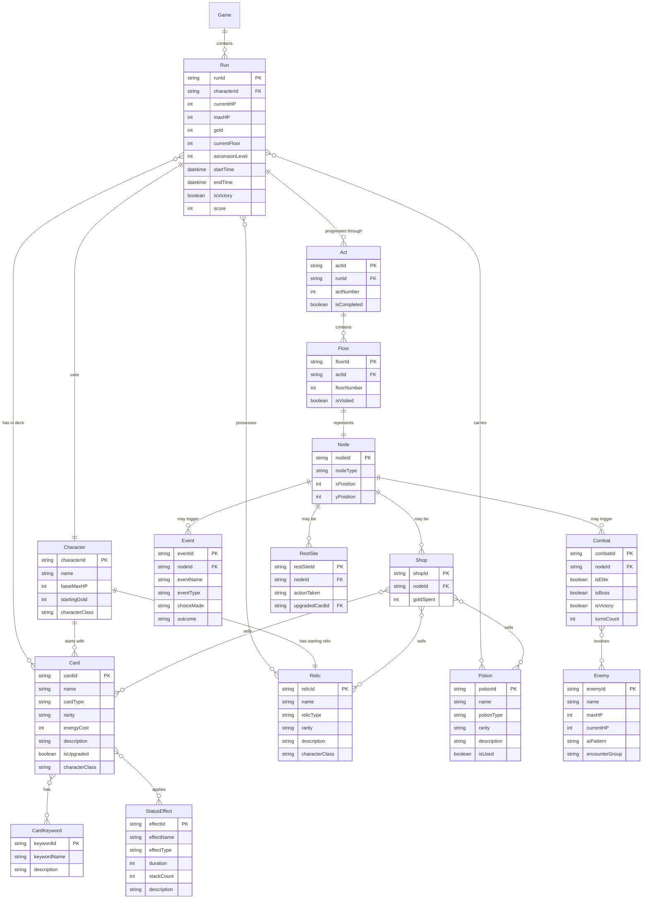

# Slay the Spire データモデル

このドキュメントは、ローグライクデッキ構築ゲーム「Slay the Spire」のデータモデルをER図で表現したものです。

## ゲーム概要

Slay the Spireは、4つのキャラクターから1つを選び、手続き的に生成された塔（Spire）を登るローグライクゲームです。プレイヤーはカードデッキを構築し、敵と戦い、レリックやポーションを収集して、最終的なボスを倒すことを目指します。

## データモデル ER図

## エンティティ詳細説明

### コアエンティティ

#### Game（ゲーム）
- ゲーム全体を管理する最上位エンティティ
- 複数のRunを保持

#### Run（ラン/プレイスルー）
- 1回のゲームプレイセッション
- キャラクター選択から開始し、勝利または敗北で終了
- HP、ゴールド、アセンションレベルなどの状態を管理

#### Character（キャラクター）
- Ironclad、Silent、Defect、Watcherの4種類
- それぞれ固有の初期ステータス、デッキ、レリックを持つ

### マップ関連

#### Act（幕）
- ゲームは3つのActに分かれている
- 各Actは複数のFloorで構成

#### Floor（階層）
- Act内の個別の階層
- プレイヤーが訪れる各地点

#### Node（ノード）
- マップ上の個別の地点
- 種類：Combat（戦闘）、Elite（エリート戦）、Event（イベント）、Shop（ショップ）、Rest（休憩所）、Boss（ボス戦）

### 戦闘関連

#### Combat（戦闘）
- ターンベースの戦闘エンカウンター
- 通常戦闘、エリート戦、ボス戦を含む

#### Enemy（敵）
- 戦闘で対峙する敵キャラクター
- HP、AIパターンを持つ

### アイテム関連

#### Card（カード）
- デッキを構成する要素
- タイプ：Attack（攻撃）、Skill（スキル）、Power（パワー）、Status（状態異常）、Curse（呪い）
- レアリティ：Common（コモン）、Uncommon（アンコモン）、Rare（レア）
- アップグレード可能

#### Relic（レリック）
- 永続的な効果を持つアイテム
- Boss Relic（ボスレリック）と通常レリックが存在

#### Potion（ポーション）
- 使い捨ての消耗品
- 最大4つまで所持可能

### その他

#### StatusEffect（状態効果）
- カードや敵の行動によって付与される一時的な効果
- Strength（筋力）、Weak（脆弱）、Vulnerable（脆弱性）など

#### CardKeyword（カードキーワード）
- カードの特殊な性質
- Exhaust（消尽）、Ethereal（一時的）、Innate（固有）、Retain（保持）など

## 主要な関係性

1. **Run ↔ Character**: 各ランは1つのキャラクターを使用
2. **Run ↔ Card/Relic/Potion**: ランの進行に応じてデッキとアイテムが変化
3. **Act ↔ Floor ↔ Node**: 階層的なマップ構造
4. **Combat ↔ Enemy**: 戦闘には1体以上の敵が登場
5. **Card ↔ CardKeyword/StatusEffect**: カードは複数のキーワードと効果を持つ

## 設計上の考慮事項

- **正規化**: 重複を避け、データの一貫性を保つ
- **拡張性**: 新しいキャラクター、カード、敵を容易に追加可能
- **プレイ履歴**: Run単位でゲーム進行を記録し、統計分析が可能
- **多対多関係**: カード/レリック/ポーションは複数のランやショップで共有される
